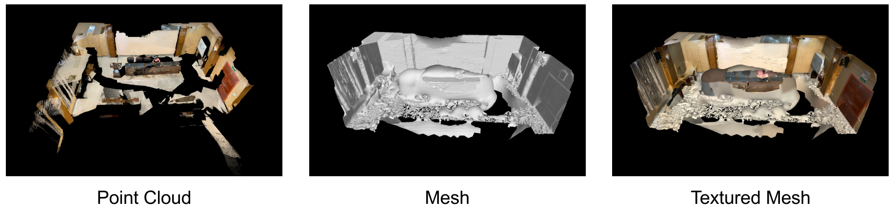

# Indoor Reconstruction Pipeline.
This project introduces pipeline for several indoor reconstruction methods, and currently this project is only tested on Linux platform.

## Data Generator
### Aim
Point cloud to depth, using the faro as an example.

### How to use
See the [README.md](DataGenerator/PointCloud2Depth/README.md)

### Data
- [x] 202 office in Wuhan University. Copyright reserved by [CVRS Lab](https://cvrs.whu.edu.cn/).
- [ ] [ETH3D](https://github.com/ETH3D/dataset-pipeline)


### Note
1. clean up the scan point cloud.
2. move the scan cube map and images into the same directory.
3. get a finer mesh.

## Mesh Reconstruction
### Poisson Reconstruction
- [Poisson Reconstruction](https://www.cs.jhu.edu/~misha/Code/PoissonRecon/Version13.80/)
```shell
# for the latest version, please visit https://www.cs.jhu.edu/~misha/Code/PoissonRecon/.
cd PoissonReconstruction
# compile the code by the Makefile.
make -j

# then use the script to reconstruct a mesh from a given point cloud.
bash scripts/point2mesh.sh path_to_pcd
```

We provide a demo data in [Baidu Disk](https://pan.baidu.com/s/1GM5fh7TqtKoRDLyGq-Uq6w) (Password: 60av) and the qualitative result is shown in the following figure.
 <div align=center>  </div>


### RGB-D Surface Reconstruction by TSDF-Fusion
- [TSDF-Fusion](https://github.com/andyzeng/tsdf-fusion)
- [X] Add CMakeLists.txt for compiling.


## Learning-based Methods
1. [NeuralRecon with our custom data](https://github.com/Haonan-DONG/awesome_indoor_reconstruction/blob/main/bib/indoor_reconstrucion/neural_radiance_field/NeuralRecon)
2. [Neural RGBD Surface Reconstruction]()