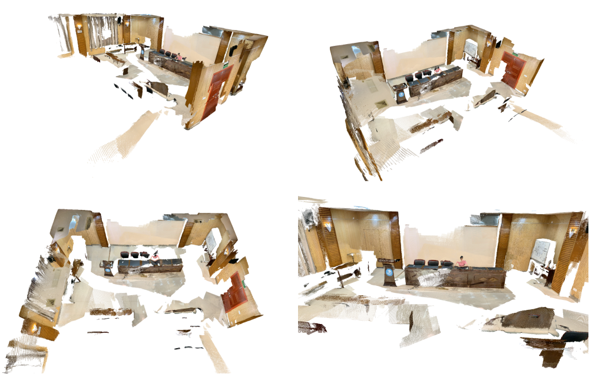

# NeuralRecon (CVPR2021)
Using the NeuralRecon for mesh reconstruction with out own data and breaking through the pipeline.

Here is the fused point cloud by the RGB-D sequence from the ARKit.
 
  

Here is the reconstructed mesh by the same data by **NeuralRecon(CVPR2021)**
 
  

## To-do List
- [X] Key frame extraction.
- [X] Align to the Scannet.
- [X] Pose checking.
- [X] Intrinsic checking and the resolution.
- [X] Scene generalization with scannet.
- [ ] Pose Expanding for mathematics.
- [ ] Upload the testing data (A indoor office).